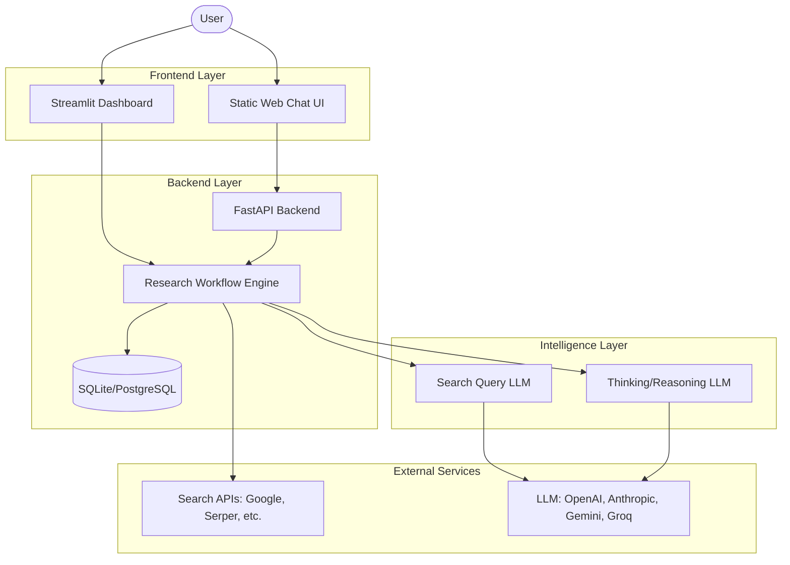

# Perplexity Deep Search 🚀

[](https://www.python.org/downloads/)
[](https://fastapi.tiangolo.com/)
[](https://opensource.org/licenses/MIT)

An intelligent research assistant inspired by Perplexity AI. It combines the power of multiple LLMs with real-time web search to deliver comprehensive, well-structured research reports.

---

## ✨ Key Features

- **🤖 Dual LLM Architecture**: 
  - **Search Query Model**: Optimized for fast and efficient search query generation.
  - **Thinking/Reporting Model**: High-reasoning models (like DeepSeek R1 or GPT-4o) for deep analysis and report synthesis.
- **🧵 Persistent Chat Memory**: Full conversation history with thread-based context management for coherent multi-turn research sessions.
- **🔍 Intelligent Research Workflow**:
  - Automated query planning and refinement.
  - Multi-source information retrieval (Google Search, Serper, etc.).
  - Context-aware analysis and synthesis.
- **🖥️ Multiple User Interfaces**:
  - **Modern Chat UI**: Clean, responsive static web interface with dark mode.
  - **Streamlit Dashboard**: Advanced research management and interactive report exploration.
- **🐳 Production Ready**: Fully containerized with Docker and Docker Compose, including Nginx for frontend serving.

---

## 🏗️ Architecture



---

## 🚀 Quick Start

### Prerequisites

- [uv](https://github.com/astral-sh/uv) (Highly Recommended)
- Docker & Docker Compose (Optional)
- API Keys for LLM (OpenAI/Anthropic/Gemini/Groq) and Search (Google/Serper)

### Option 1: Using Docker (Recommended)

1. **Clone & Setup**:
   ```bash
   git clone https://github.com/sadhiin/perplexity-deep-search.git
   cd perplexity-deep-search
   cp .env.example .env # Update with your API keys
   ```

2. **Launch Services**:
   ```bash
   docker-compose up --build
   ```

3. **Access**:
   - **Web Interface**: [http://localhost](http://localhost)
   - **Streamlit UI**: [http://localhost:8501](http://localhost:8501)
   - **API Docs**: [http://localhost:8000/docs](http://localhost:8000/docs)

### Option 2: Manual Installation (Development)

1. **Install Dependencies**:
   ```bash
   uv sync
   ```

2. **Environment Setup**:
   ```bash
   cp .env.example .env
   # Edit .env with your LLM and Search API keys
   ```

3. **Initialize Database**:
   ```bash
   uv run python scripts/init_db.py
   ```

4. **Run Services** (Each in a separate terminal):
   ```bash
   # Backend API
   uv run uvicorn backend.main:app --reload --port 8000
   
   # Streamlit Dashboard
   uv run streamlit run main.py
   
   # Static Frontend (Optional, or open frontend/index.html)
   cd frontend && python -m http.server 80
   ```

---

## ⚙️ Configuration

The application is configured via environment variables. Key variables include:

| Variable | Description | Example |
|----------|-------------|---------|
| `OPENAI_API_KEY` | OpenAI API Key | `sk-...` |
| `ANTHROPIC_API_KEY` | Anthropic API Key | `sk-ant-...` |
| `GOOGLE_SEARCH_API_KEY` | Google Custom Search API Key | `AIza...` |
| `GOOGLE_SEARCH_CX` | Google Search Engine ID | `012...` |
| `SERPER_API_KEY` | Serper.dev API Key (Alternative) | `serp...` |
| `DATABASE_URL` | Database connection string | `sqlite:///./research.db` |

---

## 📂 Project Structure

```text
.
├── backend/               # FastAPI Backend Service
│   ├── api/               # API Endpoints (v1)
│   ├── models/            # LLM Provider Logic (Query/Thinking)
│   ├── database/          # SQLAlchemy Models & Connection
│   ├── memory/            # Conversation & Context Management
│   └── main.py            # API Entry Point
├── frontend/              # Static Web Frontend
│   ├── index.html         # Modern Chat UI
│   └── script.js          # Chat Logic
├── alembic/               # Database Migrations
├── docker/                # Docker Config (Dockerfile.backend/frontend)
├── scripts/               # Utility Scripts (init_db, etc.)
├── main.py                # Streamlit Entry Point
├── workflow.py            # Core Research Logic
└── pyproject.toml         # Python Dependencies (uv)
```

---

## 📈 Roadmap

- [ ] **Phase 1**: Dual LLM Architecture (In Progress)
- [ ] **Phase 2**: Advanced Thread Chat Memory (Planned)
- [ ] **Phase 3**: Real-time collaboration features
- [ ] **Phase 4**: Multi-language and Voice support

---

## 📝 License

This project is licensed under the MIT License - see the [LICENSE](LICENSE) file for details.

## 🙏 Acknowledgments

- Inspired by **Perplexity AI**.
- Built with **FastAPI**, **Streamlit**, and **LangGraph**.
- Powered by **uv** for blazing fast dependency management.

---

<p align="center">
  <b>Made with ❤️ for the research community</b>
</p>
